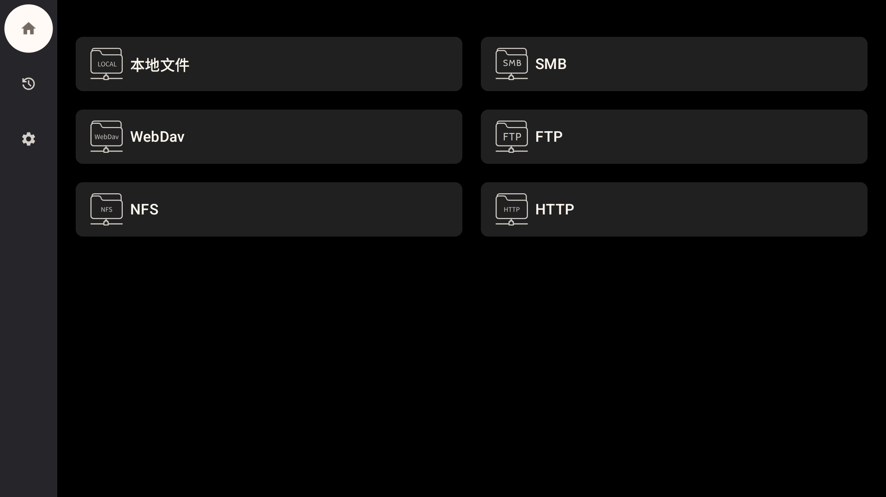
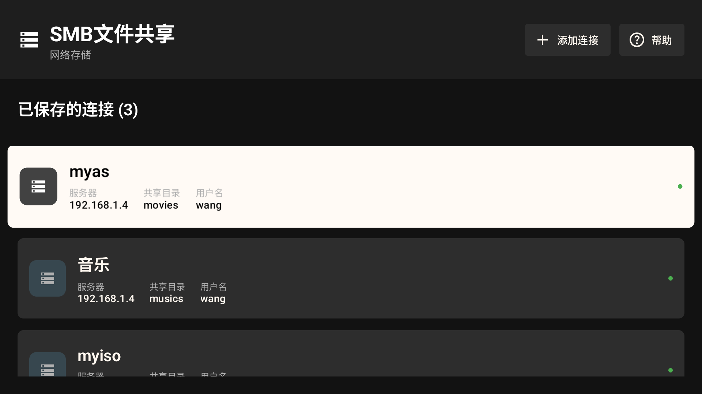
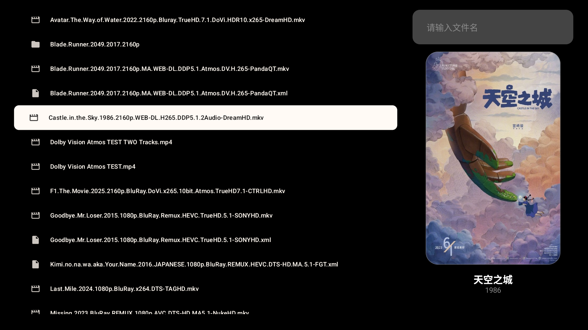
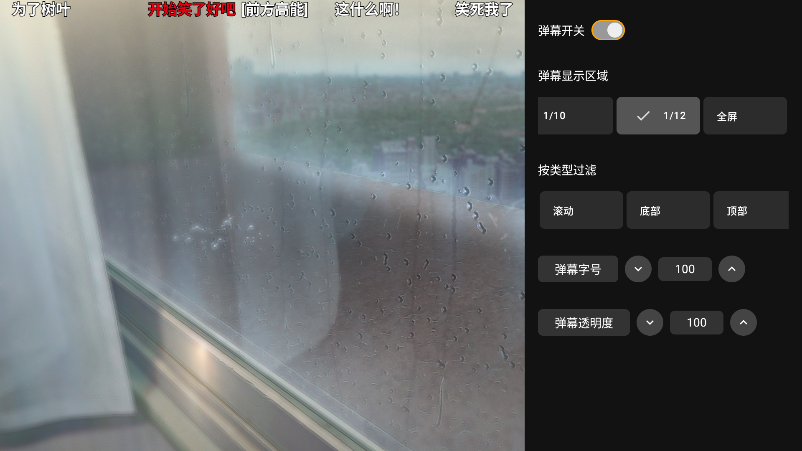
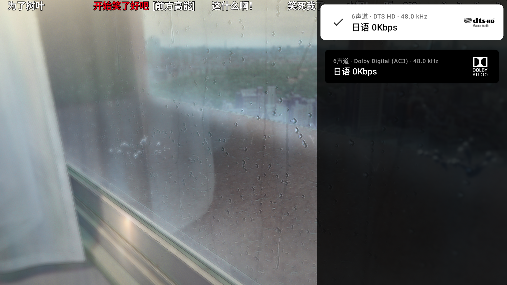
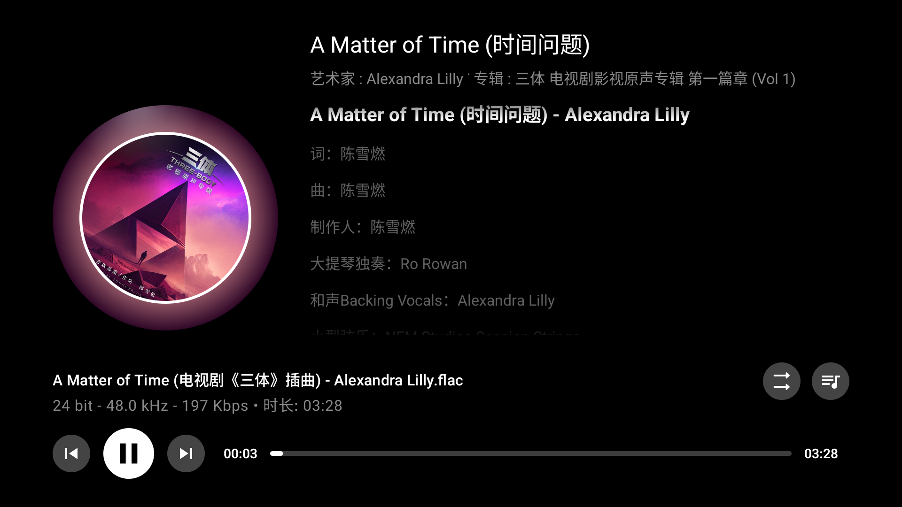

# MzDKPlayer - 安卓TV本地弹幕视频播放器

> MzDKPlayer 是一款专为安卓电视（Android TV）设计的本地视频播放器，支持弹幕功能、多种网络协议播放及音频视频格式播放。

---

## 功能特性

### 核心功能
- 🎬 **本地视频播放** - 支持多种视频格式的本地播放
- 🎵 **本地音频播放** - 支持多种音频格式的本地播放
- 💬 **弹幕功能** - 支持B站风格弹幕显示与自定义
- 🌐 **网络协议支持**：
    - ✅ SMB协议（当前已支持）
    - ✅ FTP协议（当前已支持）
    - ✅ WebDAV协议（当前已支持）
    - ✅ NFS协议（当前已支持）
    - ✅ HTTP协议（当前已支持 NGINX服务器）
- 🎚️ **多轨道选择** - 支持音轨、视频轨、字幕轨切换

### 高级编码支持
- **视频编码**：
    - 杜比视界（Dolby Vision）硬解
    - HDR视频 硬解
- **音频编码**：
    - Dolby 全系音频直通（需要设备支持）
    - DTS 全系音频直通（需要设备支持）
- **字幕格式**：
    - ASS/SSA字幕格式支持
    - SRT等常见字幕格式

### 电影/电视剧信息详情（新增 ✨）

点击视频文件后，自动解析片名与年份，调用 TMDB 获取详细信息并展示在详情页面：

- 电影和电视剧均支持详情展示
- 电影详情：显示海报、评分、简介、年份、国家、类型等
- 电视剧详情：显示海报、评分、简介、总季数/集数、当前集信息
- 自动清洗文件名（如 `阿凡达.2009.mkv` → "阿凡达 2009"），优化中文匹配
- 网络异常时回退显示默认图标和原始文件名

> ⚠️ **注意**：TMDB 在国内可能需要代理或修改 Hosts 才能稳定访问。

### 外部应用集成支持（新增 ✨）

- 🚀 **支持从其他 App 调用播放（需要相应云盘会员才能流畅播放）**  
  现在你可以直接在迅雷、阿里云盘、百度网盘、ES 文件浏览器、Chrome 等应用里点击视频，选择本播放器进行播放。

- 🔌 **杜比视界 + 全景声照样生效**  
  即使是从外部 App 打开的视频，只要设备支持，依然能正常显示杜比视界和杜比全景声标识，音画效果不打折。

- 📡 **各种链接都能播**  
  无论是网页链接（http/https）、本地文件（file），还是通过"分享"功能传过来的视频（content://），都能顺利识别并播放。

- ⚠️ **暂不支持外部调用时显示弹幕**  
  由于弹幕文件需与视频同名且位于相同目录，而外部 App 通常只传递视频链接，无法提供弹幕路径，因此 **从其他应用调用播放时，弹幕功能将自动禁用**。  
  如需使用弹幕，请通过本播放器内部的文件浏览器打开视频。


> 💡 小提示：如果经常使用，建议在电视系统里把本播放器设为默认视频播放器，体验更顺滑。

---

## 已知问题

⚠️ **重要提示：开启弹幕超大视频文件SMB播放卡顿问题（尤其在低性能设备上）**

虽然日志显示 SMB 数据预加载阶段速度稳定（如：9.7~9.9 MB/s），**但一旦视频正式开始播放并开启弹幕，读取速度会明显下降，导致播放卡顿或缓冲频繁**。

### 📊 问题表现：
- 播放前预加载日志示例：
  ```
  2025-09-19 21:59:13.913 ... I 预加载 2MB 耗时 201ms, 速度: 9.95 MB/s
  2025-09-19 21:59:14.865 ... I 预加载 2MB 耗时 205ms, 速度: 9.76 MB/s
  ```
  → 此阶段无视频解码压力，SMB 读取流畅。

- **播放开始后**：视频解码线程启动，CPU/GPU 资源被大量占用 → 导致 SMB 读取线程被抢占或调度延迟 → 读取速度骤降 → 缓冲区不足 → 卡顿！

### 🎯 根本原因：
1. **单线程/低优先级 I/O 设计**：当前 SMB 数据源未与视频解码线程充分解耦，缺乏异步预缓冲或独立高优先级下载线程。
2. **设备性能瓶颈**：在 2GB RAM 或低端芯片（如 MT9653）设备上，同时进行高码率视频解码 + 网络读取 + 弹幕渲染，极易资源争抢。
3. **ExoPlayer 缓冲策略未针对 SMB 优化**：默认缓冲区较小，网络波动或瞬时卡顿即触发卡顿。

### ✅ 临时解决方案：
- 播放70，80G的原盘视频时不要开启弹幕
- 使用其他协议 **如FTP，HTTP协议**。
- 将视频**复制到本地存储播放**，可完全规避此问题。
- 使用**有线网络**（千兆）代替 Wi-Fi，提升底层传输稳定性。
- 在播放器设置中**手动增大缓冲区大小**（若支持）。
- 降低视频码率或转码为更易解码格式（如 H.264 + AAC）。

> 💡 开发者备注：   
> 此问题将在后续版本中尝试通过"独立下载线程 + 动态缓冲区 + 优先级调度"优化(大佬来写)，但**设备性能不足仍是硬伤**。

---

## 应用演示

### 主界面与文件列表



### 播放界面与弹幕效果
  


### 电影/电视剧详情页面


---

## 技术架构

### 主要技术栈
- **媒体播放**：ExoPlayer + 自定义扩展
- **界面框架**：Jetpack Compose for TV
- **弹幕引擎**：AKDanmaku
- **字幕渲染**：ASS字幕渲染库
- **网络协议**：自定义SMB/FTP/WebDAV客户端实现

### 核心组件
- `VideoPlayerScreen` - 主播放器界面
- `BuilderMzPlayer` - 播放器构建与配置
- `AkDanmakuPlayer` - 弹幕播放组件
- `MovieDetailsScreen` / `TVSeriesDetailsScreen` - 电影/电视剧详情页面
- `FullDescriptionDialog` - 详细简介弹窗

---

## 硬件要求

### 推荐配置
- **芯片组**：Amlogic S928X-J
- **内存**：4GB RAM及以上
- **系统**：Android TV 11及以上

### 一般配置
- **芯片组**：MT9653或同等性能芯片
- **内存**：2GB RAM
- **系统**：Android TV 7及以上

### 最低要求
- **芯片组**：晶晨S905L或同等性能芯片
- **内存**：1GB RAM
- **系统**：Android TV 7及以上

> ⚠️ **注意**：代码写的烂，不会优化，能跑就成功，都是bug，设备性能不足可能导致视频与弹幕播放卡顿，或无法正常播放高码率视频

---

## 构建安装与使用

### 构建要求
- Android Studio 当下最新版本即可
- Android SDK 36+
- Java 17

### 构建步骤
1. 克隆项目到本地
2. 使用Android Studio打开项目
3. 连接支持ADB调试的安卓TV设备
4. 构建并运行应用

### 基本使用
1. 主界面选择视频文件（本地或网络）播放器会自动选择同目录下相同文件名的xml弹幕文件
2. 播放界面使用遥控器控制：
- 左右键：快进/快退
- 确认键：暂停/播放
- 菜单键：显示控制界面
- 遥控器上键弹幕设置，下键音轨选择
3. 点击视频文件可查看电影/电视剧详情（包括海报、简介、评分、年份、国家、类型等信息）

---

## 项目状态

⚠️ **开发阶段**：初始阶段，存在已知Bug

### 近期开发计划
- [x] FTP协议支持
- [x] WebDAV协议支持
- [x] NFS协议支持
- [x] 音频文件，图片文件支持
- [x] 播放列表管理
- [x] 电影/电视剧详情页面
- [ ] 网络弹幕加载功能
- [ ] 设置界面优化
- [ ] **SMB 播放性能优化（多线程缓冲 + 优先级调度）** ← 新增计划项

---

## 贡献

欢迎提交 Issue 和 Pull Request 来帮助改进这个项目。尤其欢迎对 **SMB 性能优化** 和 **播放器稳定性** 的贡献！

---

## 免责声明

本软件仅供学习交流使用，请勿用于商业用途。使用本软件造成的任何问题，开发者不承担相关责任。

---

**注意**：杜比视界、杜比全景声、DTS-HD等功能的正常使用需要设备硬件支持，部分功能可能需要特定的音频视频设备才能获得最佳体验。